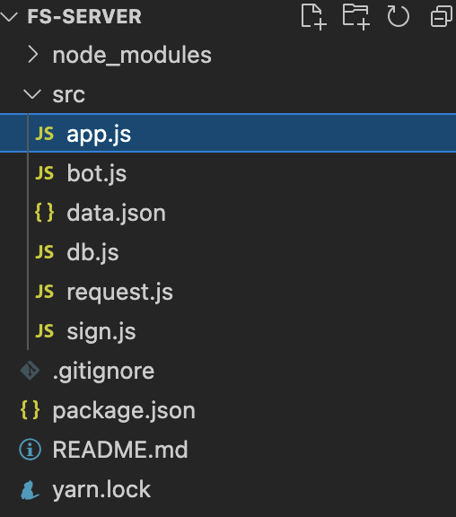
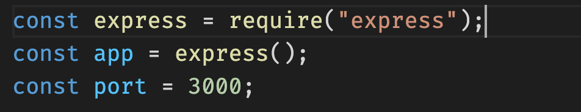
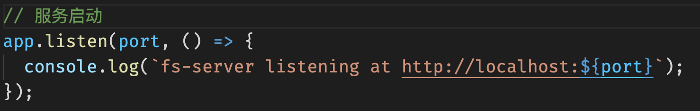
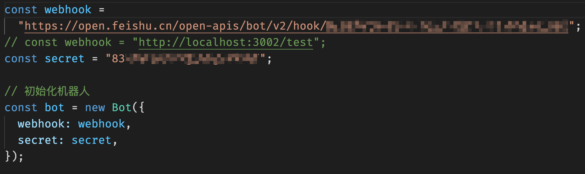
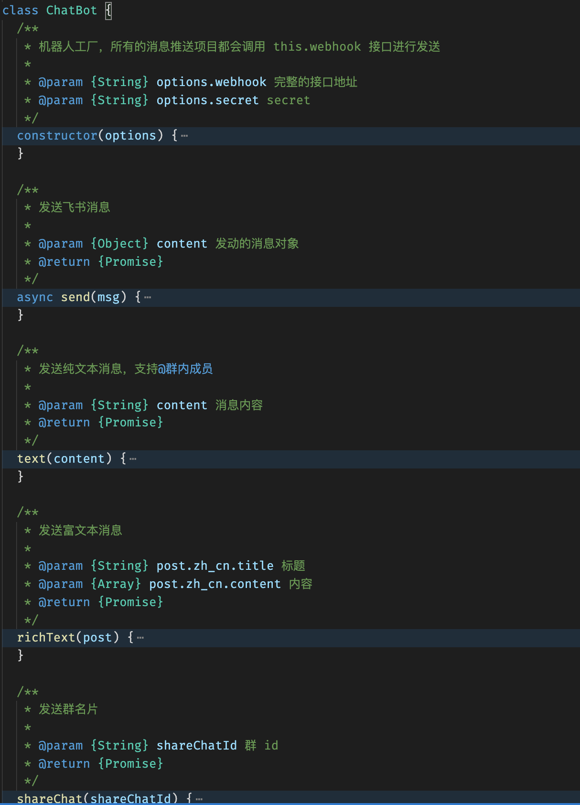
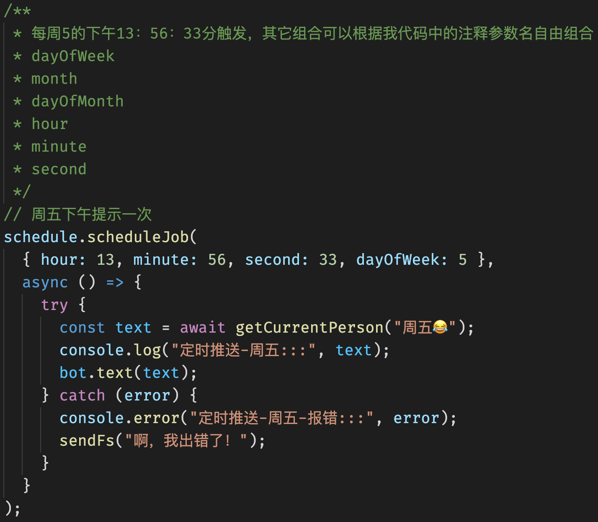
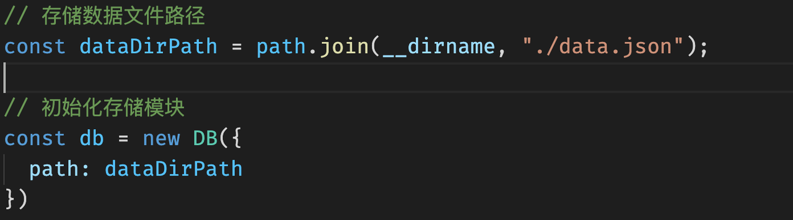
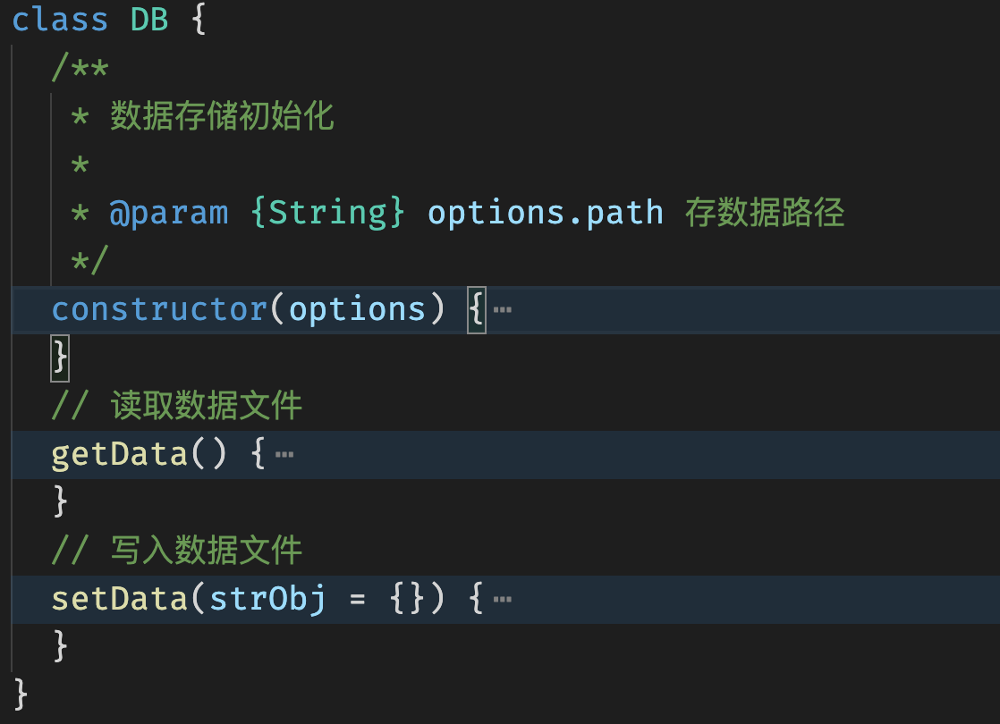
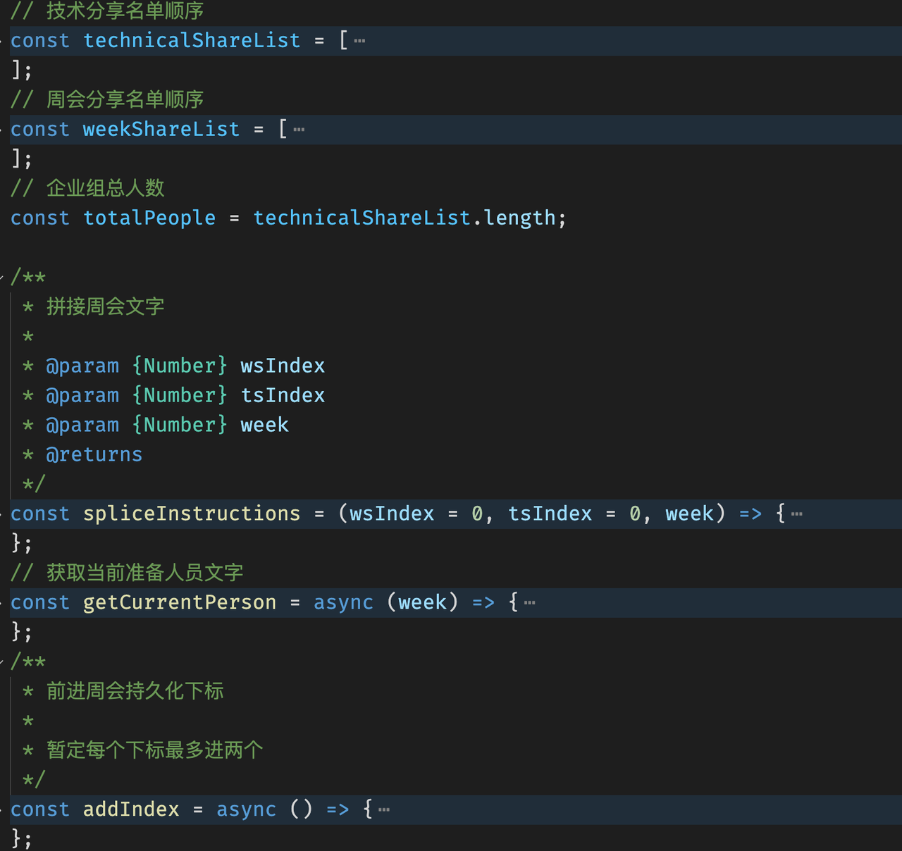

### 飞书机器人周会分享通知 
#### 服务流程图
- 
#### 项目目录结构
- 
模块
#### 1. http服务模块
> 使用express建立服务
- 
- 

#### 2. 机器人模块
> 提供机器人请求发送功能
- 
- 

#### 3. 定时器模块
> 提供定期执行功能服务 使用node-schedule
- 

#### 4. 持久化存储模块
> 提供读取或写入持久化数据存储 、使用存储本地json文件
- 
- 

#### 5. 业务模块
> 周会定期推送内容相关逻辑
- 

#### 6. 请求模块
  - axios（选用）
  - request
  - got
  - node-fetch

#### 7. 工具方法模块
  -  生成签名 （使用 crypto）

### 安装依赖
- yarn install or npm install
### 启动开发
- yarn run dev
### 启动服务
- yarn start